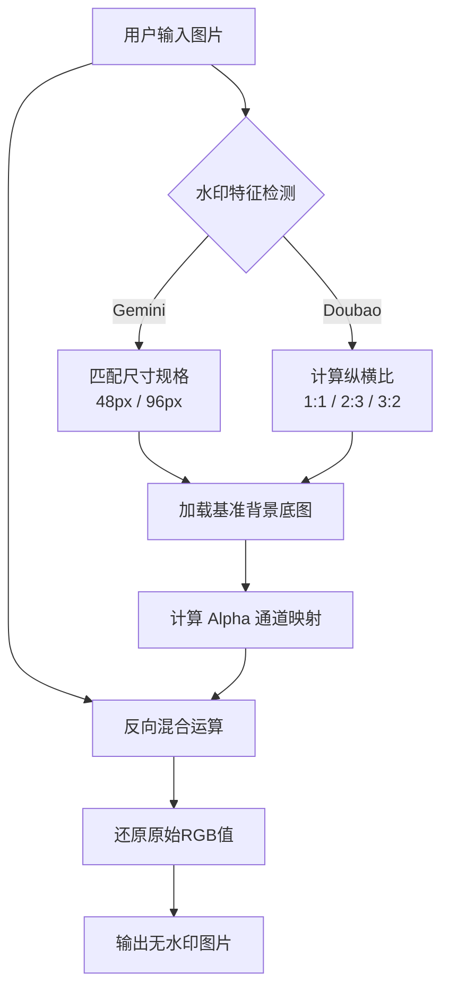

# LSJ Watermark Remover

> 纯浏览器端 AI 图像去水印工具，基于反向 Alpha 混合算法。

本工具专注于去除 Gemini、Doubao 等 AI 生成图像中的嵌入式水印。所有处理流程完全在本地浏览器中执行，利用 Canvas API 进行像素级运算，确保图像数据绝不上传至服务器，保障用户隐私安全。

## 核心特性

*   **本地运算**: 纯前端实现，无需后端服务器支持，零网络延迟。
*   **隐私安全**: 图片数据仅驻留于用户设备内存，无数据泄露风险。
*   **算法原理**: 采用反向 Alpha 混合 (Reverse Alpha Blending) 技术，通过预置的背景底图计算水印 Alpha 通道，精确还原被覆盖的原始像素。
*   **多模型适配**: 自动识别 Gemini (48px/96px) 及 Doubao (1:1/2:3/3:2) 等不同类型和比例的水印配置。
*   **批量处理**: 支持多图并发处理与打包下载。

## 工作原理



## 快速开始

### 在线/本地运行

无需安装任何依赖，直接使用现代浏览器打开 `index.html` 即可使用。

### 部署托管

如需在本地网络中共享，可使用任意静态文件服务器：

```bash
# Python
python -m http.server 8080

# Node.js
npx serve .
```

访问 `http://localhost:8080` 即可。

## 技术栈

*   **Core**: Vanilla JavaScript (ES Modules)
*   **UI**: Tailwind CSS (Pixel Art Style)
*   **Processing**: HTML5 Canvas API
*   **Utils**: JSZip (打包), Exifr (元数据), Medium Zoom (预览)

## 许可证

本项目采用 [Apache License 2.0](LICENSE) 授权。